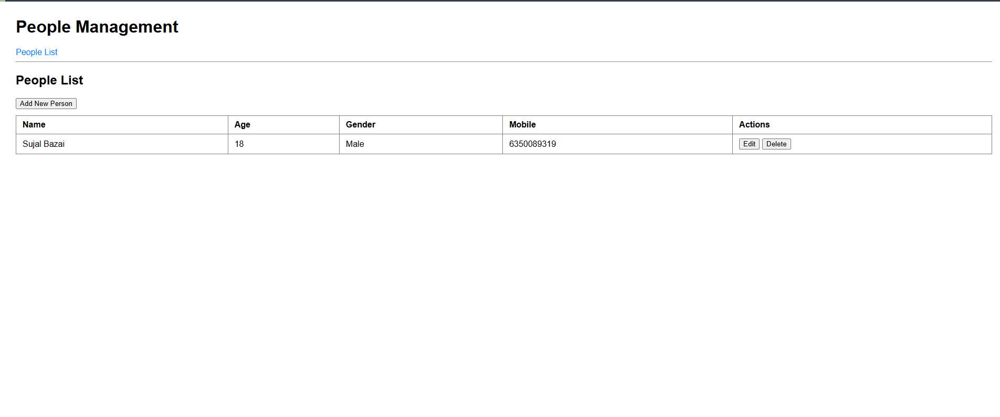
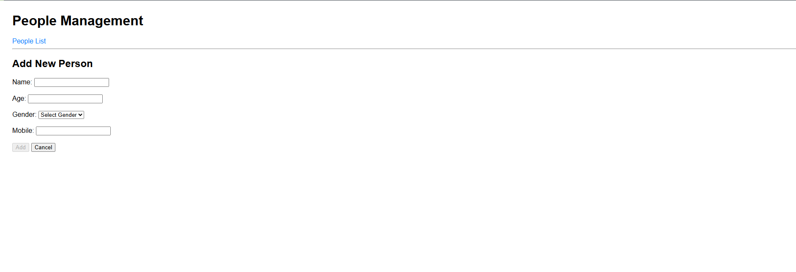

<<<<<<< HEAD
# Person_LIST
=======
People Manager
A full-stack web application to manage a list of people, built with Angular 8 (frontend), Node.js/Express (backend), and MongoDB (database).

Features
List all people

Add a new person

Edit a person’s details

Delete a person

Simple, clean UI

RESTful API integration

Tech Stack
Frontend: Angular 8, TypeScript, HTML, CSS

Backend: Node.js, Express, Mongoose

Database: MongoDB

Screenshots

Getting Started
Prerequisites
Node.js (v14.x or v18.x with --openssl-legacy-provider)

npm

Angular CLI (npm install -g @angular/cli)

MongoDB (running locally or in the cloud)

1. Clone the Repositories
bash
git clone https://github.com/YOUR_USERNAME/people-manager-frontend.git
git clone https://github.com/YOUR_USERNAME/people-manager-backend.git
2. Backend Setup
bash
cd people-manager-backend
npm install
Configure MongoDB
By default, the app connects to mongodb://localhost:27017/people_db

To change, edit config/db.config.js

Start the Backend
bash
node app.js
The backend will run on http://localhost:3000

3. Frontend Setup
bash
cd people-manager-frontend
npm install
Start the Frontend
If using Node.js v18.x or higher:

bash
# Windows PowerShell
$env:NODE_OPTIONS="--openssl-legacy-provider"
ng serve

# Windows CMD
set NODE_OPTIONS=--openssl-legacy-provider
ng serve

# Or add to package.json scripts for convenience
If using Node.js v14.x:
Just run:

bash
ng serve
The frontend will run on http://localhost:4200

4. Using the App
Open your browser and go to http://localhost:4200

You should see the People List.

Use the Add, Edit, and Delete buttons to manage people.

Project Structure
Frontend
text
src/app/
├── models/
├── services/
├── person-list/
├── person-edit/
├── person-delete/
├── app-routing.module.ts
├── app.module.ts
├── app.component.ts
└── app.component.html
Backend
text
/models
/controllers
/routes
/config
app.js
API Endpoints
Method	Endpoint	Description
GET	/person	Get all people
GET	/person/:id	Get a person by ID
POST	/person	Add a new person
PUT	/person/:id	Update a person
DELETE	/person/:id	Delete a person
Customization
Update API URLs in person.service.ts if your backend runs on a different host/port.

Add more fields or validation as needed.

Troubleshooting
CORS errors: Make sure backend uses app.use(cors());

MongoDB connection errors: Ensure MongoDB is running and accessible.

Node.js v18+ crypto errors: Use --openssl-legacy-provider as shown above.

License
MIT License

Author
SUJAL BAZARI

Happy coding! If you have any issues, feel free to open an issue or PR.

>>>>>>> 5a8f2a6 (Initial commit)
